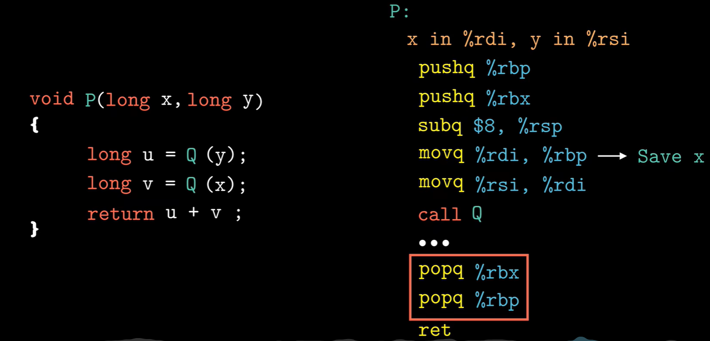

#### 3.4 寄存器名字

##### 3.4.1 操作数

#### 3.5 指令

#### 3.6

##### 3.6.1 条件码

##### 3.6.2 访问条件码

#### 3.7

##### 3.7.5 寄存器中的局部存储空间

调用函数前，需要保存现场，便于等一下恢复。因为寄存器只有这几个，所以当需要再次调用某个寄存器时，需要把原来的值放入栈内保存，最后再恢复。比如图中，我们就要用到rbp寄存器。